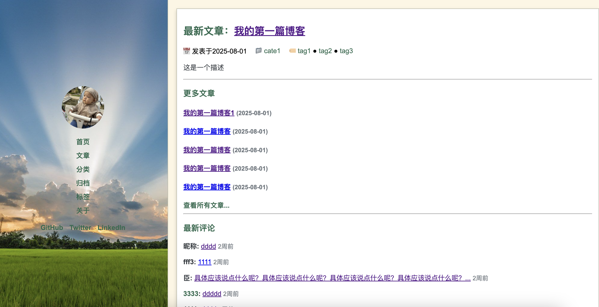
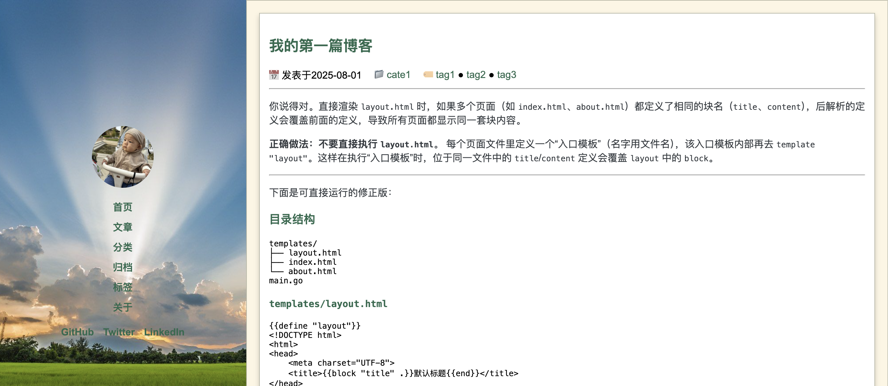
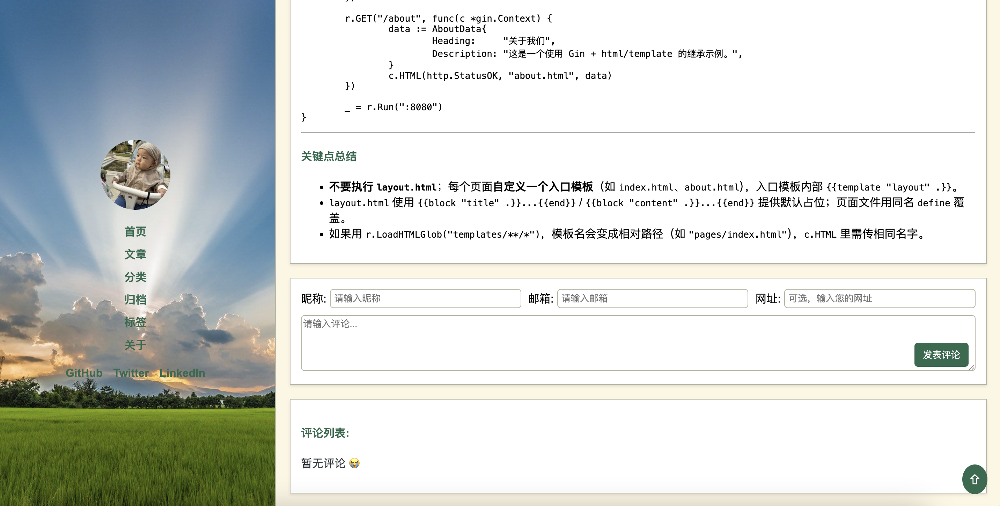

## lazyblog

初始化数据库： `go run cmd/main.go --initdb`

运行: `go run cmd/main.go`

## 文章发表

```sh
cp test/post.md.example ${dir}/xxx.md

vim ${dir}/xxx.md

go run cmd/publish.go ${dir}/xxx.md
```

## 截图






## TODO

- 接入图床
- 编辑发布页
- markdown支持mermaid
- templates和static加入ci
